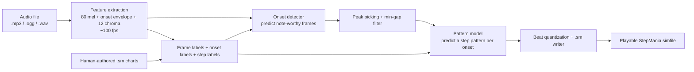
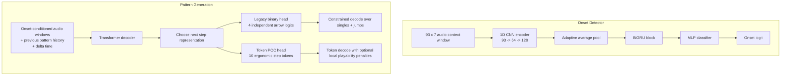
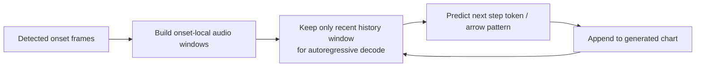

# StepMania AI

ML-powered StepMania chart generator. Takes an audio file and generates a `.sm` simfile with Expert/Challenge-level step charts.

## Architecture

Current codebase is a two-stage pipeline trained on human-authored simfiles, with an experimental tokenized pattern path for playability-focused research.

1. **Onset Detector** — scores each ~10ms audio frame as "place a note here" or not
2. **Pattern Generator** — generates the actual step pattern at detected onsets

### System Overview



### Model View



### Generation-Time Decode Loop



Notes:

- The onset model class defines a CNN + BiGRU, but the current training/inference path uses `forward_framewise()`, so the effective context today is dominated by the local 7-frame window rather than long-sequence recurrence.
- The token pattern path is intentionally constrained to common singles and jumps. The goal is not to force jumps into every song; it is to make pattern generation easier to analyze, ablate, and improve.
- Holds are now preserved distinctly in the parser/dataset and the codebase includes a first-pass hold predictor. Rolls are recognized in the parser/cache but are not yet generated back out.
- Generation now uses a rolling recent-history window during autoregressive decode, which keeps 1-minute previews practical without asking the model to reason over more history than it saw in training.

### Audio Features

Extracted at ~100fps (~10ms per frame) using librosa. All features are aligned to the same time grid:

| Feature | Shape per song | Size | What it captures |
|---------|---------------|------|-----------------|
| **Mel spectrogram** | (80, n_frames) | ~6.8 MB | Frequency content across 80 mel-scaled bands. Captures the timbral texture of the audio — bass hits, hi-hats, vocals, synths |
| **Onset strength envelope** | (n_frames,) | ~87 KB | How likely a musical "event" (hit, note, transient) is at each frame. Derived from spectral flux. Primary signal for note placement |
| **Chroma** | (12, n_frames) | ~1 MB | Pitch class energy (C, C#, D, ... B). Captures harmonic/melodic content — useful for placing notes on melodic phrases vs percussion |

These three features are stacked into a 93-channel feature vector (80 + 1 + 12) per frame. The model sees a context window of 7 frames (~70ms) centered on each position.

### Training

- **Balanced sampling**: only ~5% of frames have notes, so onset frames are oversampled to 50/50 balance
- **Two-phase**: onset detector trains first on all frames, then pattern generator trains only on onset frames
- **Pattern-model ablations**: the project now supports both the original binary arrow head and a tokenized ergonomic POC
- **Song-level validation split**: training can hold out a reproducible slice of songs for validation and early stopping
- **Parallel data loading**: audio feature extraction runs across CPU workers (4 by default)
- **TensorBoard**: training logs train/validation loss, precision/recall/F1, per-arrow accuracy, and learning rate to `runs/`

## Memory & Performance

### Data loading

Audio feature extraction happens once per song and is cached to `.cache/features/`. Each cached song is ~8 MB in memory (mel + onset + chroma + labels). Extraction uses multiprocessing (4 workers by default) and takes ~3-5 seconds per uncached song.

| Songs | In-memory | Cache on disk | First load | Subsequent loads |
|-------|-----------|---------------|------------|-----------------|
| 24 | ~200 MB | ~200 MB | ~2 min | seconds |
| 200 | ~1.6 GB | ~1.6 GB | ~12 min | seconds |
| 1000+ | ~8 GB | ~8 GB | ~60 min | seconds |

### Training

Training uses MPS (Apple Silicon), CUDA, or CPU. GPU memory usage is modest (~1-2 GB) since batches are small feature windows, not full spectrograms.

**Recommended minimum**: 16 GB RAM for up to ~1500 songs.

## Setup

```bash
python3 -m venv .venv
source .venv/bin/activate
pip install -e ".[dev]"
```

Requires Python 3.11+. Uses PyTorch with MPS (Apple Silicon), CUDA, or CPU.

## Usage

### Train on simfile packs

```bash
smai-train path/to/pack1 path/to/pack2 \
    --epochs-onset 50 \
    --epochs-pattern 80 \
    --batch-size 256 \
    --pattern-mode token
```

Fast verification run:

```bash
smai-train ~/Downloads/StepmaniaPipelineSmaller \
    --dev
```

Pattern-only POC run that reuses an existing onset checkpoint:

```bash
smai-train ~/Downloads/StepmaniaPipelineSmaller \
    --pattern-mode token \
    --epochs-hold 4 \
    --skip-onset-training \
    --onset-checkpoint checkpoints/smaller-dev-20260402-164827/onset_detector.pt
```

Or pick a reproducible subset from a larger pack:

```bash
smai-train ~/Downloads/StepmaniaPipeline \
    --max-songs 96 \
    --train-samples-per-epoch 100000 \
    --validation-split 0.1 \
    --patience 2
```

### Monitor training

```bash
tensorboard --logdir runs
# Open http://localhost:6006
```

Tracks: onset and pattern train/validation loss, onset precision/recall/F1, pattern accuracy (overall + per-arrow), and learning rates.

### Generate a chart from audio

```bash
smai-generate song.ogg \
    --onset-model checkpoints/onset_detector.pt \
    --pattern-model checkpoints/pattern_generator.pt \
    --hold-model checkpoints/hold_note_predictor.pt \
    --difficulty Challenge \
    --rating 10 \
    --threshold 0.5 \
    --temperature 0.8
```

The generator will automatically detect whether the pattern checkpoint is:

- a legacy binary-arrow model
- a tokenized ergonomic pattern model

### Utilities

```bash
# Parse and inspect a .sm file
smai-parse path/to/song.sm

# Extract and summarize audio features
smai-extract path/to/song.ogg
```

## Tuning

- **`--threshold`** (onset detector): higher = fewer notes, lower = more notes. 0.3-0.7 is the useful range.
- **`--temperature`** (pattern generator): lower = more predictable/repetitive patterns, higher = more variety. 0.5-1.0 is typical.
- **More training data** improves quality significantly. Add multiple packs with `smai-train pack1 pack2 pack3`.

## .sm Format

The generator outputs standard StepMania `.sm` files compatible with StepMania 5, OpenITG, and other SM-compatible engines. Place the generated `.sm` file alongside the audio file in a song folder within your StepMania Songs directory.
